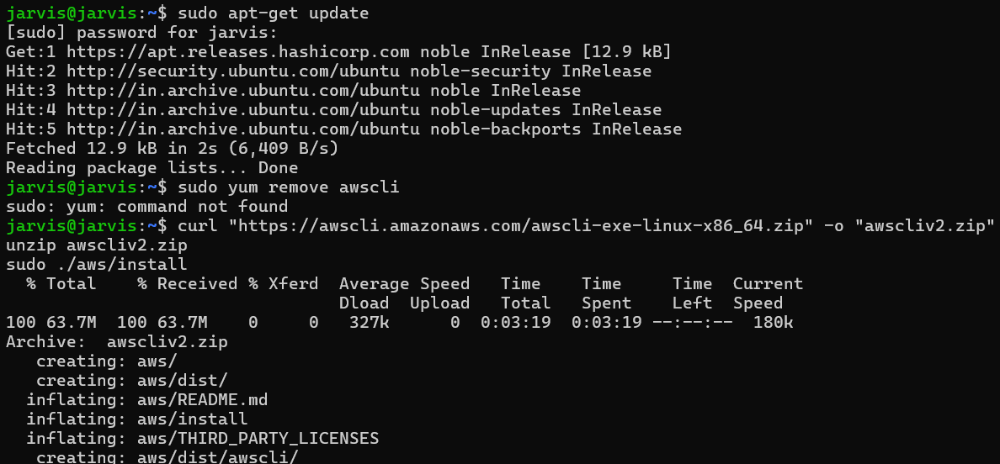
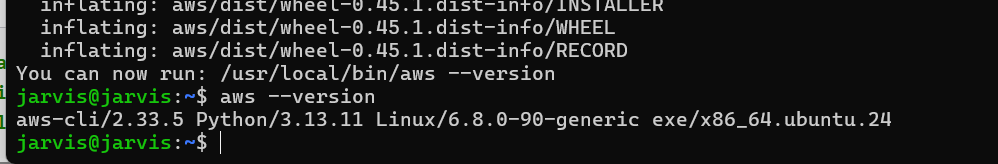
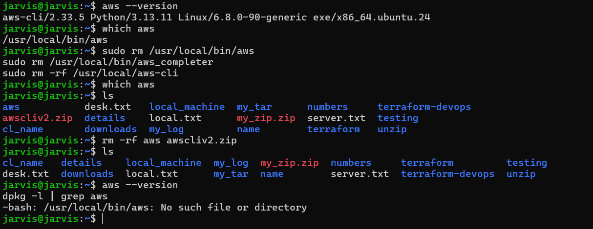

## steps to download aws-cli


## I am using my ubuntu linux.
Offical AWS Documentation: [LINK](https://docs.aws.amazon.com/cli/latest/userguide/getting-started-install.html)

## followed the shared code and instruction to install aws cli.


## installation successfull.


## steps to uninstall



```
jarvis@jarvis:~$ aws --version
aws-cli/2.33.5 Python/3.13.11 Linux/6.8.0-90-generic exe/x86_64.ubuntu.24
```
```
jarvis@jarvis:~$ which aws
/usr/local/bin/aws
```
```
sudo rm /usr/local/bin/aws
sudo rm /usr/local/bin/aws_completer
sudo rm -rf /usr/local/aws-cli
```
```
jarvis@jarvis:~$ ls
aws           desk.txt   local_machine  my_tar      numbers     terraform-devops
awscliv2.zip  details    local.txt      my_zip.zip  server.txt  testing
cl_name       downloads  my_log         name        terraform   unzip
```

```
rm -rf aws awscliv2.zip
```
```
aws --version
dpkg -l | grep aws
```