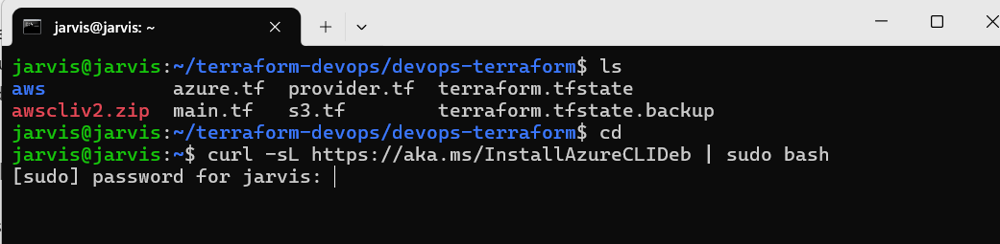
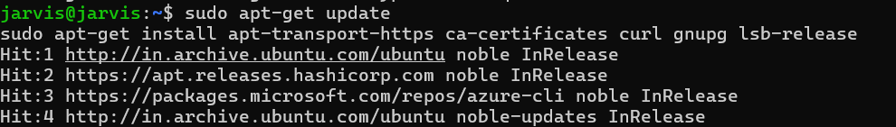
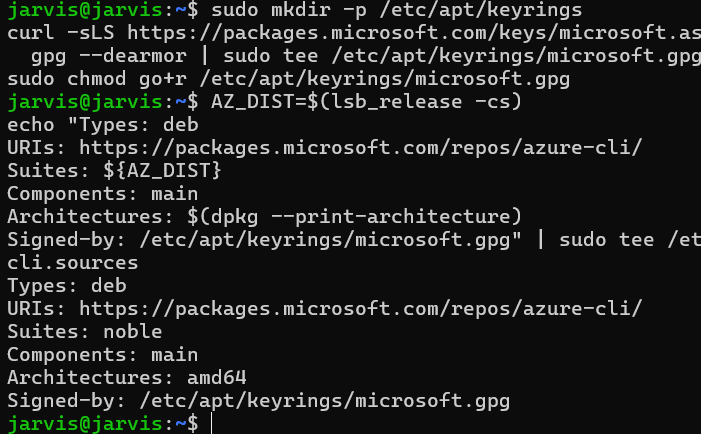
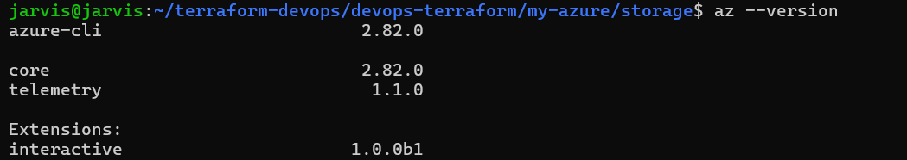
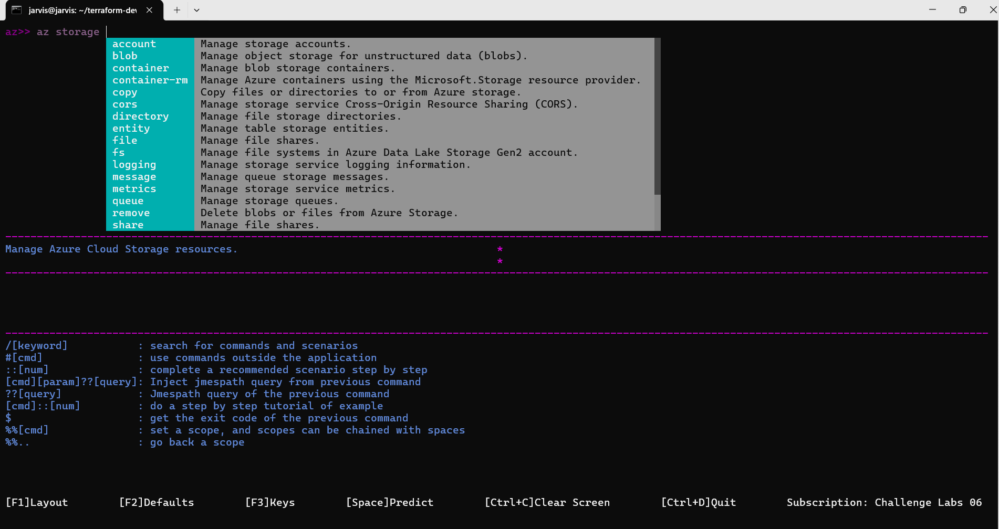

## Offical Azure Documentation [Link](https://learn.microsoft.com/en-us/cli/azure/install-azure-cli-linux?view=azure-cli-latest&pivots=apt)

## Installing Azure CLI

I am using linux

Option 1: Install with one command



## Option 2: Step-by-step installation instructions

### Get packages needed for the installation process:



### Download and install the Microsoft signing key:

### Add the Azure CLI software repository:



###  Update repository information and install the azure-cli package:

### az cli Installed



## az login 
follow the steps shown on your screen.
checking account


### az interactive ( interactive mode is auto completion of commands and ai support smart suggestion)





## You can skip preloading in a single pass by CTRL+C or turn it off by setting 

```az config set interactive.enable_preloading=False```