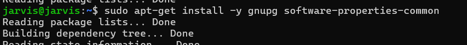
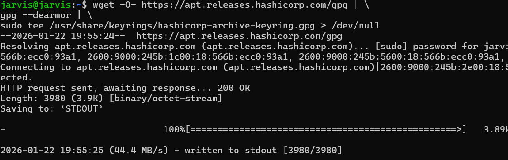
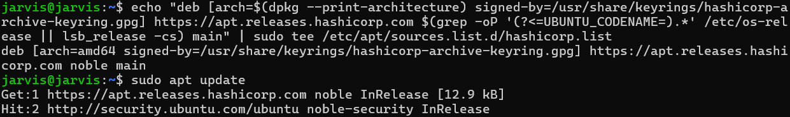
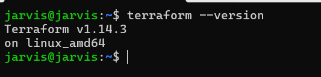

## In this Module we are setting up terraform

I am using my ubuntu-server-linux machine for this tutorial.
Firstly Login into the ubuntu server using ssh-private-key using 

```
ssh -i %USERPROFILE%\.ssh\azure_cmd_key jarvis@192.1258.1.105


```
Enter your password for private key if there is any.

- Get your machine with the latest updates

```
sudo apt-get updates
```


Now follow the offical Documentation from HashiCorp to install terraform.

```
sudo apt-get update && sudo apt-get install -y gnupg software-properties-common
```


```
wget -O- https://apt.releases.hashicorp.com/gpg | \
gpg --dearmor | \
sudo tee /usr/share/keyrings/hashicorp-archive-keyring.gpg > /dev/null

```


```
gpg --no-default-keyring \
--keyring /usr/share/keyrings/hashicorp-archive-keyring.gpg \
--fingerprint

```


```
echo "deb [arch=$(dpkg --print-architecture) signed-by=/usr/share/keyrings/hashicorp-archive-keyring.gpg] https://apt.releases.hashicorp.com $(grep -oP '(?<=UBUNTU_CODENAME=).*' /etc/os-release || lsb_release -cs) main" | sudo tee /etc/apt/sources.list.d/hashicorp.list
```



```
sudo apt update
```


```
sudo apt-get install terraform
```


```
terraform --version
```


```
XXXXX
```

```
XXXXX
```

```
XXXXX
```


```
XXXXX
```


```
XXXXX
```


```
XXXXX
```