## create main.tf file
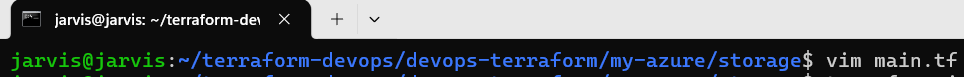

## main.tf
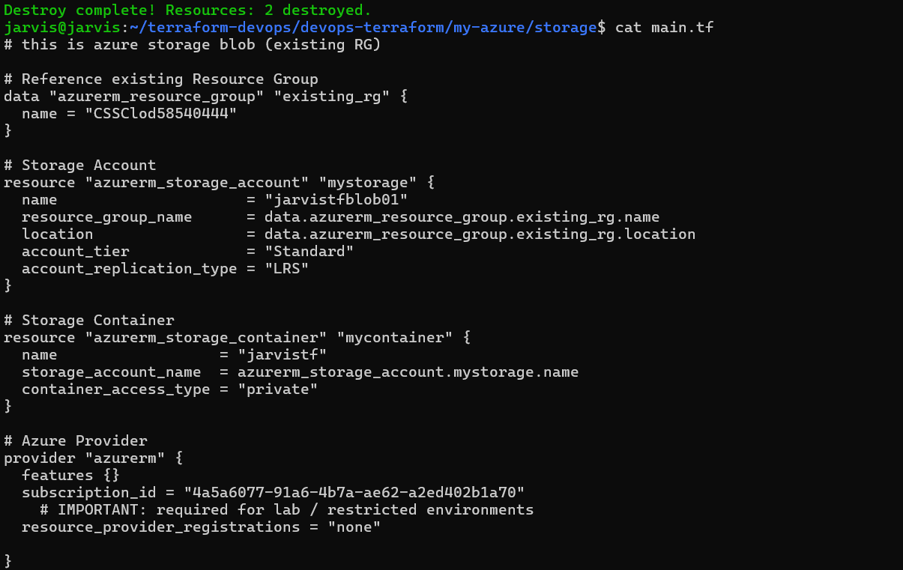

You might need to modify your main.tf according to your azure account.

I am using free azure lab for with the limited permission so i had to modify my code accordingly.

## terraform plan
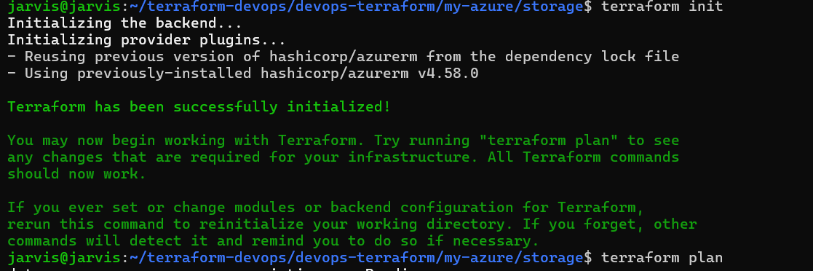

## login into the az account

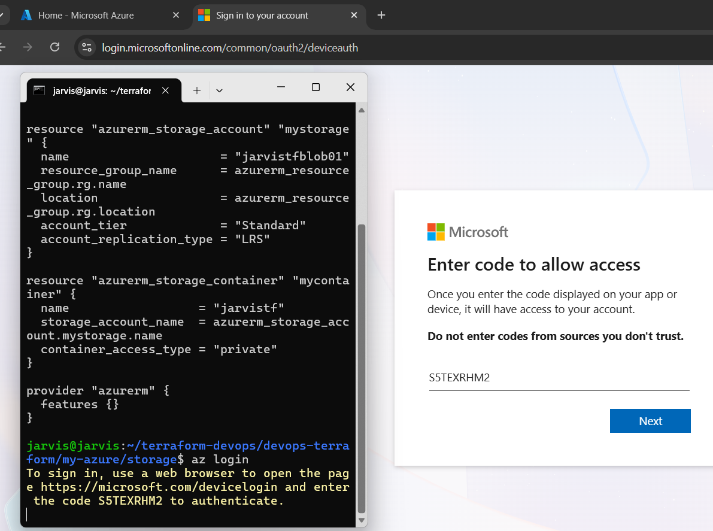

## terraform validate
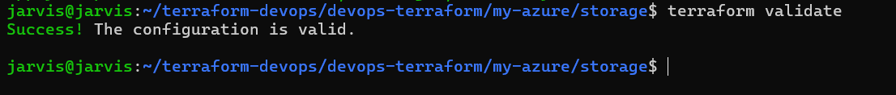

## terraform plan
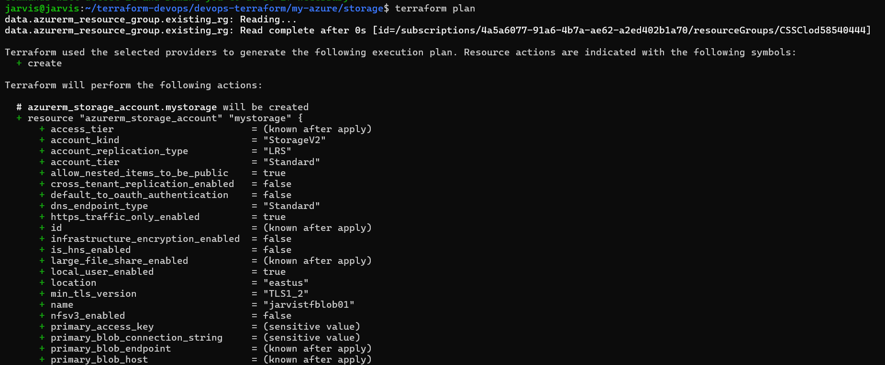

## terraform apply -auto-approve
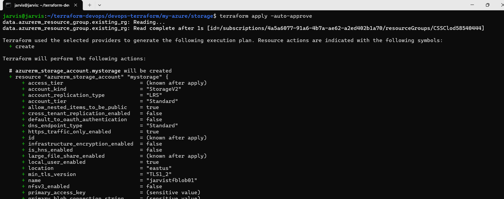

final output :

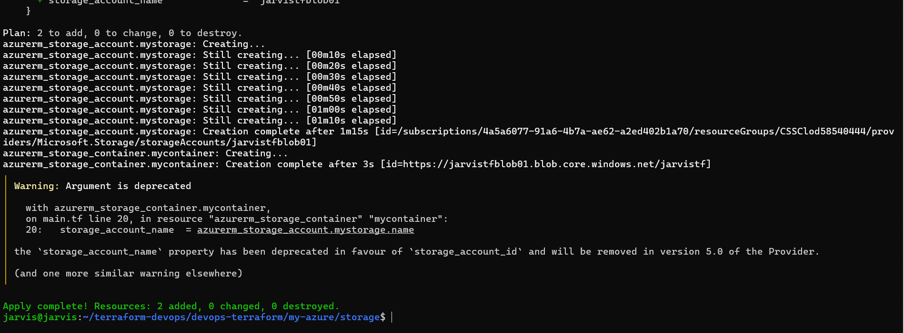

## storage account created 
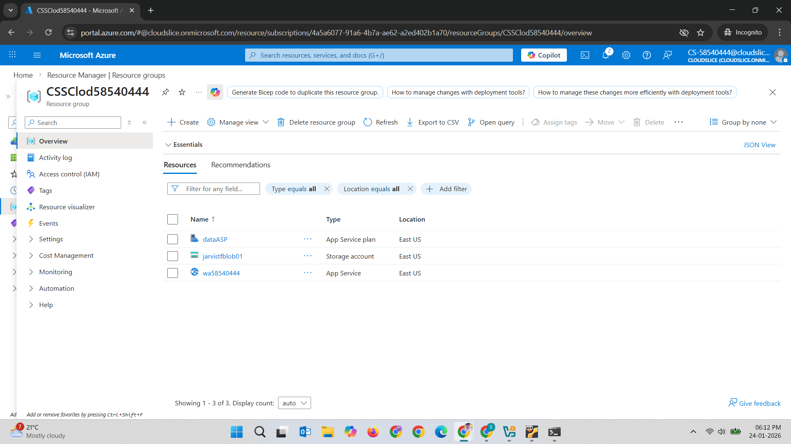

## storage account info
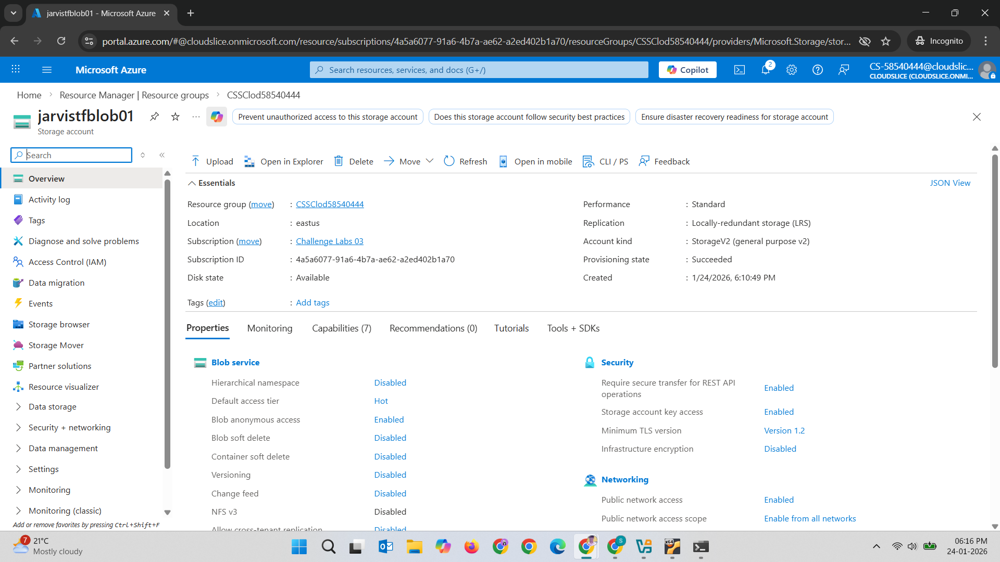

## terraform destroy
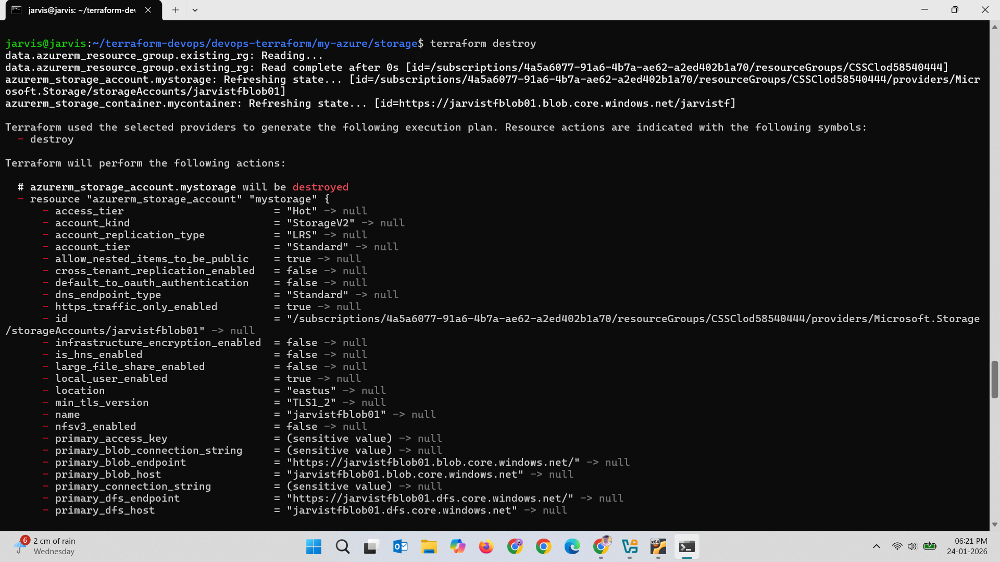

final output : 
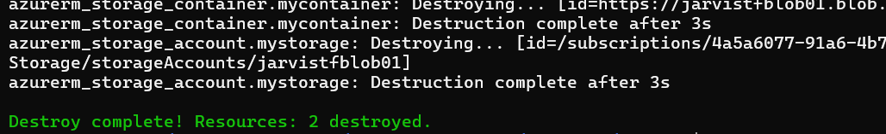

## status of azure

It is deleted.
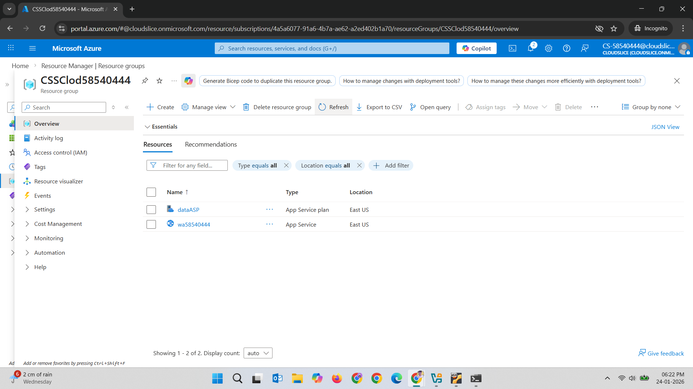