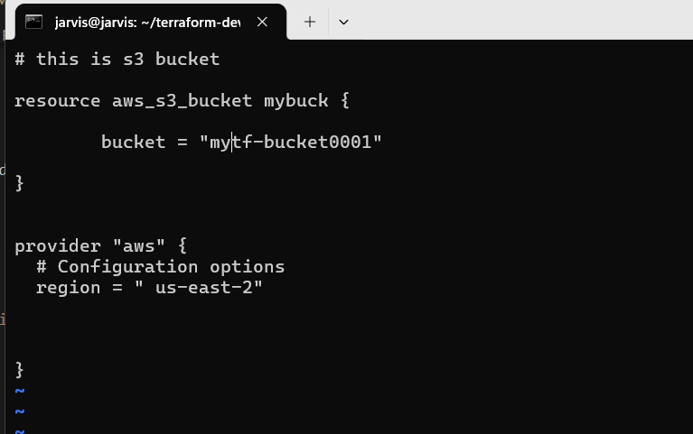
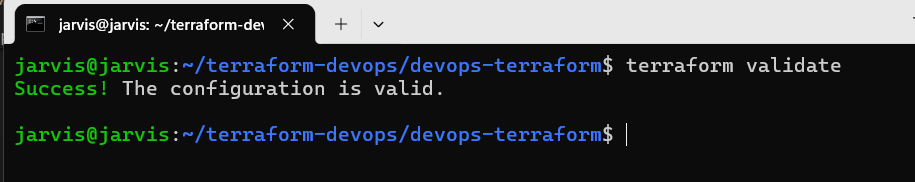

## Local provider

## creating s3 bucket via tf

## using aws as a provider.

## initialize the terraform again.

run `terraform init` to get the aws provider added.

## aws provider is added

## Adding other providers

Officials link for Terraform Providers : [Click Link](http://registry.terraform.io/browse/providers)

## Installing other provider manually.

## Required tf code (azurerm) as provider

## terraform init and it worked!

## Adding tf aws provider

## everthing looks fine.

