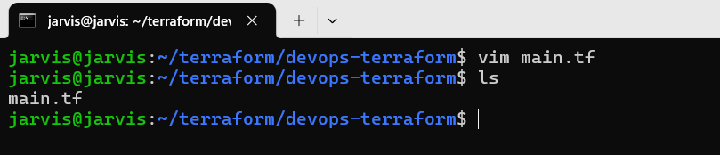
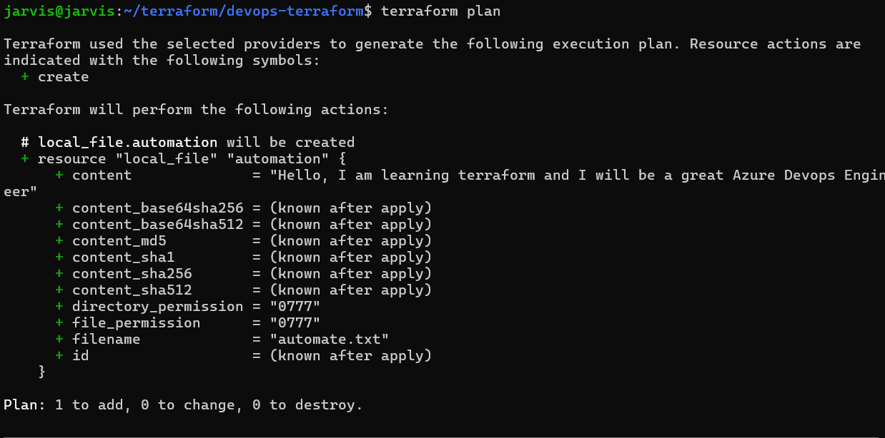

## Creating a directory for Terraform.

## Created first terraform file.

## Basic context for the terraform(Block> Parameter> Argurments)

## Viewing the tf file content.

## Initiated the terrafrom in this folder in order to be able to run the tf file.

## Vaildate the tf file content.

## terraform plan 

Serving as a safe "dry run" that lets you preview infrastructure changes before they are actually made. 

## terraform apply

## It worked!

## terraform destroy

## terraform apply -auto-approve

## terraform destroy -auto-approve
